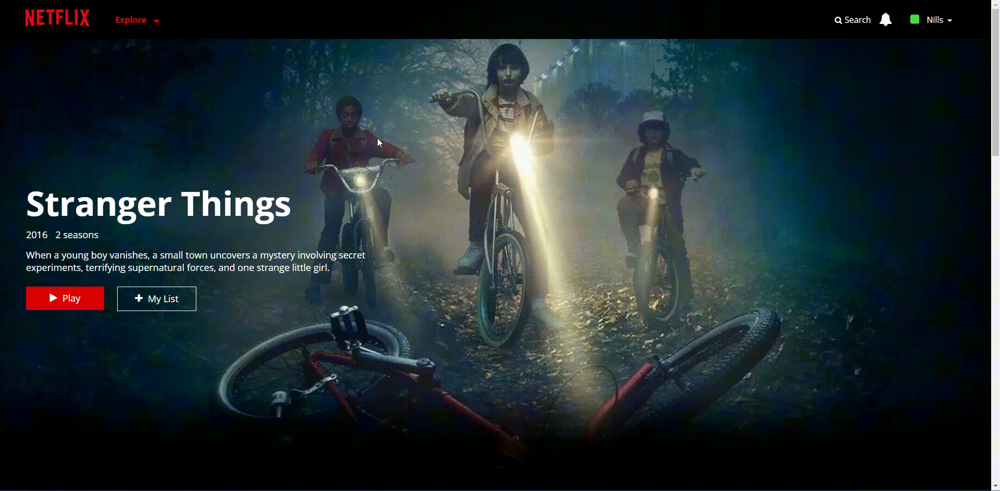

# Netflix Clone

My version of Netflix. Built with Vue.JS.

Let me know what you guys think!

Check out the Project:  https://nillsvanlimbeek.github.io/netflix_clone

>P.S. Sometimes the posters dont show up. If that is the case please refresh the page.

## User Stories
* The main page shows the most populair movies and TV series in five categories. (Netflix Originals, Action, Drama, Comedy and Fantasy).
* User can change the logged in user in the top right corner.
* User can scroll through the sections.
* User can click on the play and arrow buttons to get more information on the clicked item.
* User can search for movies and TV shows.
* User can click on the search results to get more information.

